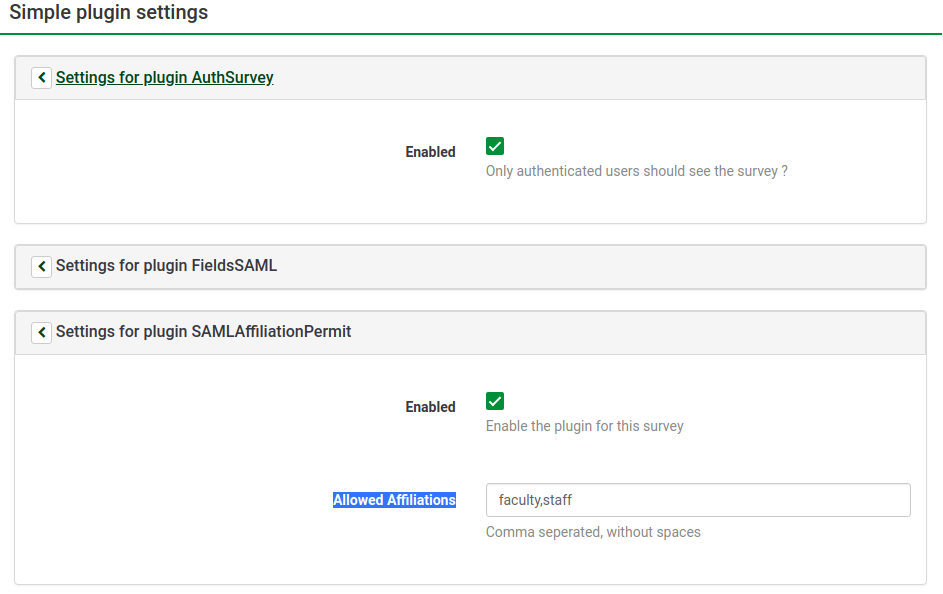

# limesurvey-saml-affiliation-surveys
Limesurvey plugin to filter users per survey based on SAML affiliation attribute.

## Requirements
* LimeSurvey 3.XX
* [SAML-Plugin](https://github.com/auth-it-center/Limesurvey-SAML-Authentication)

## Installation instructions
1. Copy **SAMLAffiliationPermit** folder with its content at **limesurvey/plugins** folder
2. Go to **Admin > Configuration > Plugin Manager** or **https:/example.com/index.php/admin/pluginmanager/sa/index**
and **Enable** the plugin

## How to enable plugin for specific survey
1. Go to **Surveys > (Select desired survey) > Simple Plugins** or
**https:/example.com/index.php/admin/survey/sa/rendersidemenulink/surveyid/{survey_id}/subaction/plugins**
2. Open **Settings for plugin AuthSurvey** accordion
3. Click **Enabled** checkbox
4. Open **Settings for plugin AuthSurvey** accordion
5. Click **Enabled** checkbox

## Configuration options

### Global
* **SAML attribute used as affiliation** The SAML attribute to apply the filter on

### Plugin
* **Enabled** If checked then the plugin is enabled for the selected survey
* **Allowed Affiliations** Comma seperated list of the allowed affiliations that are allowed to participate on the survey

## Images
